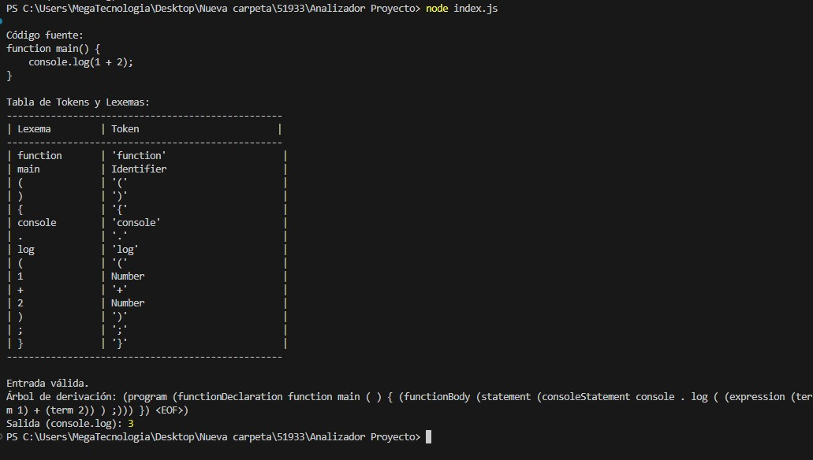
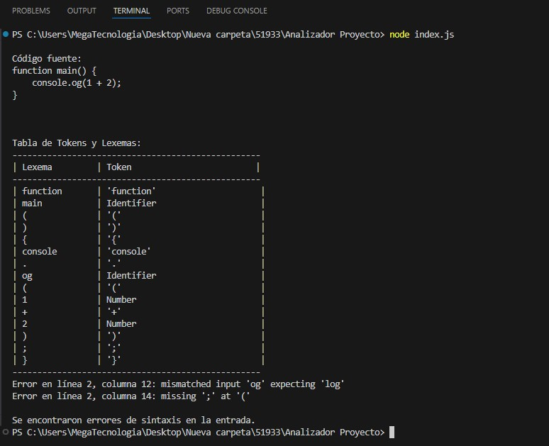
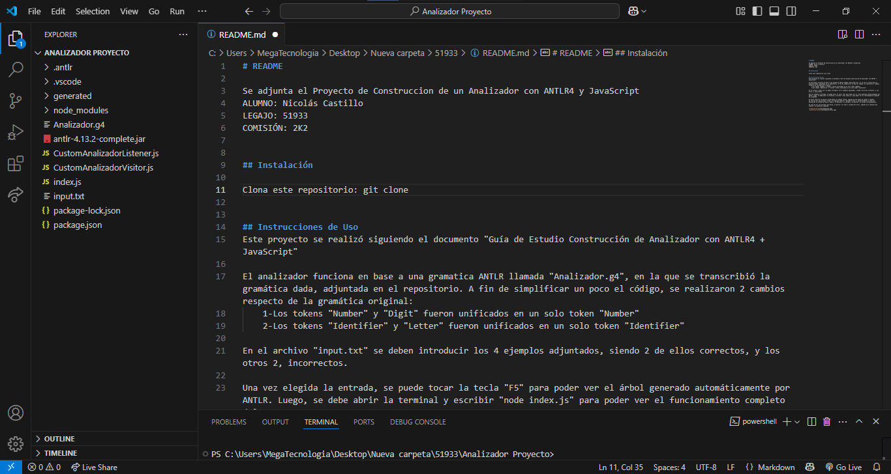

# README

Se adjunta el Proyecto de Construccion de un Analizador con ANTLR4 y JavaScript
ALUMNO: Nicolás Castillo
LEGAJO: 51933
COMISIÓN: 2K2

## Instalación

Clona este repositorio: git clone https://github.com/NicoCastillo05/51933.git

## Instrucciones de Uso
Este proyecto se realizó siguiendo el documento "Guía de Estudio Construcción de Analizador con ANTLR4 + JavaScript"

El analizador funciona en base a una gramatica ANTLR llamada "Analizador.g4", en la que se transcribió la gramática dada, adjuntada en el repositorio. A fin de simplificar un poco el código, se realizaron 2 cambios respecto de la gramática original:
    1-Los tokens "Number" y "Digit" fueron unificados en un solo token "Number"
    2-Los tokens "Identifier" y "Letter" fueron unificados en un solo token "Identifier"

En el archivo "input.txt" se deben introducir los 4 ejemplos adjuntados, siendo 2 de ellos correctos, y los otros 2, incorrectos.

Una vez elegida la entrada, se puede tocar la tecla "F5" para poder ver el árbol generado automáticamente por ANTLR. Luego, se debe abrir la terminal y escribir "node index.js" para poder ver el funcionamiento completo del programa.

El mismo consiste en mostrar primeramente el Código fuente, seguido de una tabla de tokens y lexemas.
En caso de ser una entrada válida, el programa mostrará "Entrada Válida" y posteriormente el Árbol de derivación en formato de texto. Además, se ejecutará la entrada y se mostrará la salida correspondiente.

En caso de ser una entrada incorrecta, se marcará la linea y columna del error, seguido de un mensaje que indicará la expresión esperada.

